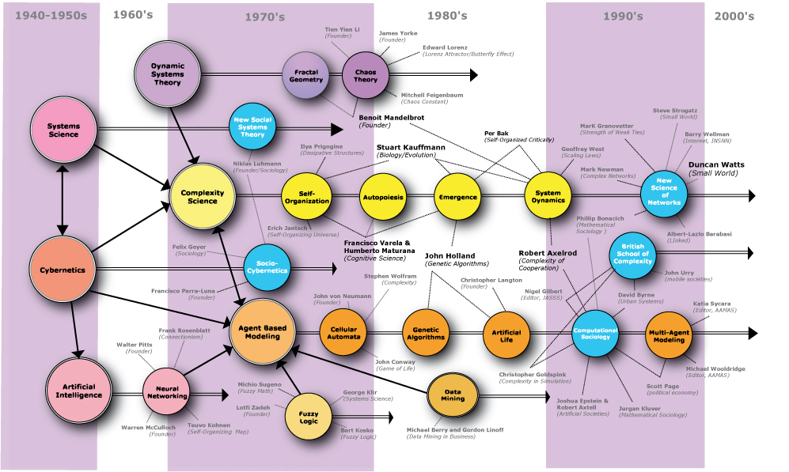

# [awesome-complexity](https://github.com/jepemo/awesome-complexity) 

A curated list of amazingly awesome **Complexity Science** resources, courses  and shiny things inspired by the [Complexity Explorer/Santa Fe Institute](https://www.complexityexplorer.org/).

There are [other sites with](https://github.com/sellisd/awesome-complexity) curated lists of resources about Complexity science which you can have a look at.

- [Awesome Complexity](#awesome-complexity)
  - [Concepts](#concepts)
    - [Definitions](#definitions)
    - [Glossary](#glossary)
  - [Books](#books)
  - [Articles](#articles-and-papers)
  - [Courses](#courses)
  - [Other resources](#other)

## Concepts

### Definitions

> About complexity science, which is an interdisciplinary field—at the intersection of mathematics, computer science and natural science—that focuses on discrete models of physical systems. In particular, it focuses on complex systems, which are systems with many interacting components. - [Think Complexity Book](http://greenteapress.com/complexity/html/index.html)

> Complexity characterises the behaviour of a system or model whose components interact in multiple ways and follow local rules, meaning there is no reasonable higher instruction to define the various possible interactions. - [Wikipedia](https://en.wikipedia.org/wiki/Complexity)

> Complexity theory is really a movement of the sciences. Standard sciences tend to see the world as mechanistic...The movement that started complexity looks in the other direction. It’s asking, how do things assemble themselves? How do patterns emerge from these interacting elements? Complexity is looking at interacting elements and asking how they form patterns and how the patterns unfold. - [Wikiquote](https://en.wikiquote.org/wiki/Systems_theory)

[Source](https://en.wikipedia.org/wiki/File:Map-of-complexity-science.jpg)

### Glossary

- [Adaptive systems](https://en.wikipedia.org/wiki/Adaptive_system) - 123456789
- [Attractor](https://en.wikipedia.org/wiki/Attractor) - 123456789
- [Autopoiesis](https://en.wikipedia.org/wiki/Autopoiesis) - The ability of a system to create and maintain itself
- [Artificial intelligence](https://en.wikipedia.org/wiki/Artificial_intelligence) - 123456789
- [Chaos](https://en.wikipedia.org/wiki/Chaos_theory) - 123456789
- [Cybernetics](https://en.wikipedia.org/wiki/Cybernetics) - 123456789
- [Developmental systems theory](https://en.wikipedia.org/wiki/Developmental_systems_theory) - 123456789
- [Dissipative system](https://en.wikipedia.org/wiki/Dissipative_system) - 123456789
- [Edge of Chaos](https://en.wikipedia.org/wiki/Edge_of_chaos) - 123456789
- [Emergence](https://en.wikipedia.org/wiki/Emergence) - 123456789
- [Entropy](https://en.wikipedia.org/wiki/Entropy) - 123456789
- [Fractal](https://en.wikipedia.org/wiki/Fractal) - 123456789
- [Holon](https://en.wikipedia.org/wiki/Holon_(philosophy)) - System that is both a whole and a part
- [Information Theory](https://en.wikipedia.org/wiki/Information_theory) - 123456789
- [Machine learning](https://en.wikipedia.org/wiki/Machine_learning) - 123456789
- More definitions in the [Complexity Explorer Page](https://www.complexityexplorer.org/explore/glossary).

## Books

[**Complexity: A Guided Tour**](https://www.amazon.com/gp/product/0199798109/ref=as_li_tl?ie=UTF8&camp=1789&creative=9325&creativeASIN=0199798109&linkCode=as2&tag=jepemolinks-20&linkId=425bcd3ff350748f2bb13e85663a4920) by [Melanie Mitchell](https://scholar.google.es/citations?user=k4gbv2AAAAAJ&hl=ca&oi=ao) - Tour of the sciences of complexity, a broad set of efforts that seek to explain how large-scale complex, organized, and adaptive behavior can emerge from simple interactions among myriad individuals.

[**Think Complexity: Complexity Science and Computational Modeling**](https://www.amazon.com/gp/product/1492040207?ie=UTF8&tag=jepemolinks-20&camp=1789&linkCode=xm2&creativeASIN=1492040207) by [Allen Downey](https://scholar.google.es/citations?user=GxBFR3sAAAAJ&hl=ca&oi=ao) - Introduction to complexity where you’ll use graphs, cellular automata, and agent-based models to study topics in physics, biology, and economics, using Python as a programming language.

[**Vida artificial: del Caos al Orden** (Spanish)](https://www.amazon.com/gp/product/8493138266/ref=as_li_tl?ie=UTF8&camp=1789&creative=9325&creativeASIN=8493138266&linkCode=as2&tag=jepemolinks-20&linkId=b912007851d458366f6b2ee88ef19b1d) by [José Gabriel Segarra](https://www.amazon.es/JOSE-GABRIEL-SEGARRA-BERENGUER-Libros/s?ie=UTF8&page=1&rh=n%3A599364031%2Ck%3AJOSE%20GABRIEL%20SEGARRA%20BERENGUER) - Easy introduction to many concepts of complex systems.

[**Chaos: Making a New Science**](https://www.amazon.com/gp/product/0143113453?ie=UTF8&tag=jepemolinks-20&camp=1789&linkCode=xm2&creativeASIN=0143113453) by [James Gleick](https://es.wikipedia.org/wiki/James_Gleick) - Describes the Mandelbrot set, Julia sets, and Lorenz attractors without using complicated mathematics. It portrays the efforts of dozens of scientists whose separate work contributed to the developing field. The text remains in print and is widely used as an introduction to the topic for the mathematical layperson.

## Articles and Papers

- [ON COMPUTABLE NUMBERS, WITH AN APPLICATION TO THE ENTSCHEIDUNGSPROBLEM](https://www.cs.virginia.edu/~robins/Turing_Paper_1936.pdf) - Explains the concept of Turing Machine, that is a mathematical model of computation that defines an abstract machine.
- [A Mathematical Theory of Communication](http://math.harvard.edu/~ctm/home/text/others/shannon/entropy/entropy.pdf) - The original paper of C. E. SHANNON about the information theory. It studies the quantification, storage, and communication of information.

## Courses

[**Introduction to Complexity**](https://www.complexityexplorer.org/courses/89-introduction-to-complexity) by the [Complexity Explorer/Santa Fe Institute](https://www.complexityexplorer.org/) - In this course you'll learn about the tools used by scientists to understand complex systems. The topics you'll learn about include dynamics, chaos, fractals, information theory, self-organization, agent-based modeling, and networks.

[**Introduction to Information Theory**](https://www.complexityexplorer.org/courses/55-introduction-to-information-theory)  by the [Complexity Explorer/Santa Fe Institute](https://www.complexityexplorer.org/) - Introduces fundamental concepts in information theory. Information theory has made considerable impact in complex systems, and has in part co-evolved with complexity science.

[**Fractals and Scaling**](https://www.complexityexplorer.org/courses/93-fractals-and-scaling) by the [Complexity Explorer/Santa Fe Institute](https://www.complexityexplorer.org/) - Overview of how ideas from fractals and scaling are used to study complex systems.

## Other

- [Map of Complex systems History](http://www.art-sciencefactory.com/complexity-map_feb09.html) - An impressive overview of the evolution of complex systems thinking.
