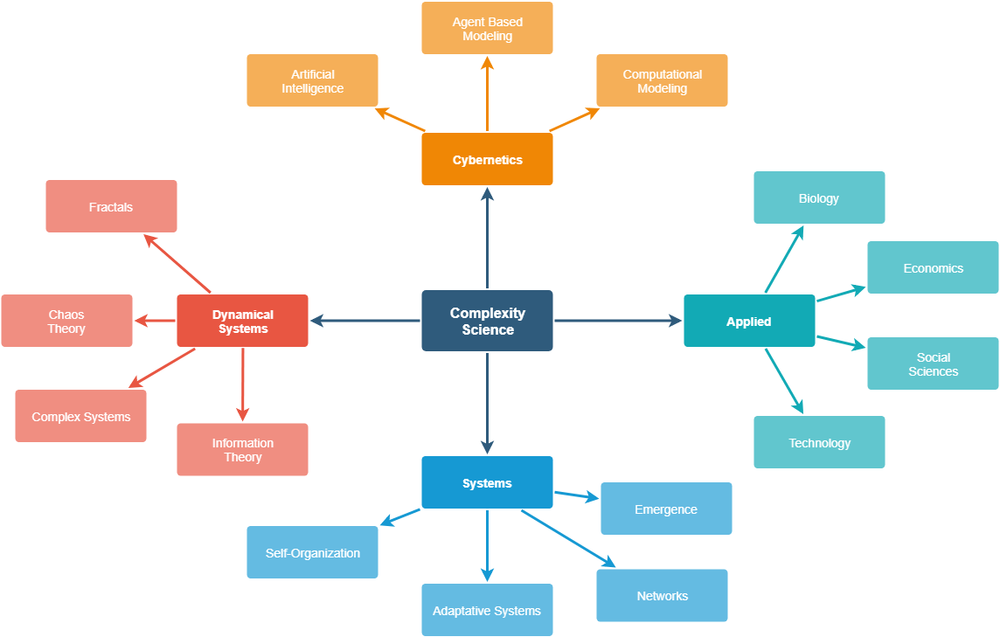

# [awesome-complexity](https://github.com/jepemo/awesome-complexity) 

A curated list of amazingly awesome **Complexity Science** resources, courses  and shiny things inspired by the [Complexity Explorer/Santa Fe Institute](https://www.complexityexplorer.org/).

There are [other sites with](https://github.com/sellisd/awesome-complexity) curated lists of resources about Complexity science which you can have a look at.

- [Awesome Complexity](#awesome-complexity)
  - [Concepts](#concepts)
  - [Books](#books)
    - [Introduction](#instroduction)
    - [Agent modeling](#agent-modeling)
    - [Applied Complexity](#applied-complexity)
    - [Chaos](#chaos)
    - [Cybernetics](#cybernetics)
    - [Information Theory](#information-theory)
    - [Networks](#networks)
  - [Articles](#articles-and-papers)
  - [Courses](#courses-and-tutorials)
  - [Other resources](#other)

## Concepts

### Definitions

> About complexity science, which is an interdisciplinary field—at the intersection of mathematics, computer science and natural science—that focuses on discrete models of physical systems. In particular, it focuses on complex systems, which are systems with many interacting components. - [Think Complexity Book](http://greenteapress.com/complexity/html/index.html)

> Complexity characterises the behaviour of a system or model whose components interact in multiple ways and follow local rules, meaning there is no reasonable higher instruction to define the various possible interactions. - [Wikipedia](https://en.wikipedia.org/wiki/Complexity)

> Complexity theory is really a movement of the sciences. Standard sciences tend to see the world as mechanistic...The movement that started complexity looks in the other direction. It’s asking, how do things assemble themselves? How do patterns emerge from these interacting elements? Complexity is looking at interacting elements and asking how they form patterns and how the patterns unfold. - [Wikiquote](https://en.wikiquote.org/wiki/Systems_theory)

[Source](https://en.wikipedia.org/wiki/File:Map-of-complexity-science.jpg)

### Simple Glossary

- [Adaptive systems](https://en.wikipedia.org/wiki/Adaptive_system) - System that has the ability to adapt to a changing environment.
- [Agent Based Modeling](https://en.wikipedia.org/wiki/Agent-based_model) - Alass of computational models for simulating the actions and interactions of autonomous agents (both individual or collective entities such as organizations or groups) with a view to assessing their effects on the system as a whole.
- [Attractor](https://en.wikipedia.org/wiki/Attractor) - In the mathematical field of dynamical systems, an attractor is a set of numerical values toward which a system tends to evolve, for a wide variety of starting conditions of the system.
- [Autopoiesis](https://en.wikipedia.org/wiki/Autopoiesis) - The ability of a system to create and maintain itself
- [Artificial intelligence](https://en.wikipedia.org/wiki/Artificial_intelligence) - Intelligence demonstrated by machines.
- [Chaos](https://en.wikipedia.org/wiki/Chaos_theory) - Interdisciplinary theory stating that within the apparent randomness of chaotic complex systems, there are underlying patterns.
- [Cybernetics](https://en.wikipedia.org/wiki/Cybernetics) - Transdisciplinary approach for exploring regulatory systems—their structures, constraints, and possibilities
- [Complex Network](https://en.wikipedia.org/wiki/Complex_network) - A Graph (network) with non-trivial topological features.
- [Complex System](https://en.wikipedia.org/wiki/Complex_system) - System composed of many components which may interact with each other.
- [Developmental systems theory](https://en.wikipedia.org/wiki/Developmental_systems_theory) - Theoretical perspective (that emphasizes the shared contributions of genes) on biological development, heredity, and evolution.
- [Dissipative system](https://en.wikipedia.org/wiki/Dissipative_system) - A thermodynamically open system far from thermodynamic equilibrium.
- [Edge of Chaos](https://en.wikipedia.org/wiki/Edge_of_chaos) - A region of bounded instability (transition space) that engenders a constant dynamic interplay between order and disorder.
- [Emergence](https://en.wikipedia.org/wiki/Emergence) - Condition of an entity having properties its parts do not have, due to interactions among the parts.
- [Entropy](https://en.wikipedia.org/wiki/Entropy) - Measure of how many different microstates there are that could give rise to the macrostate that the system is in.
- [Fractal](https://en.wikipedia.org/wiki/Fractal) - Subset of a Euclidean space for which the Hausdorff dimension strictly exceeds the topological dimension.
- [Holon](https://en.wikipedia.org/wiki/Holon_(philosophy)) - System that is both a whole and a part.
- [Information Theory](https://en.wikipedia.org/wiki/Information_theory) - Field that studies the quantification, storage, and communication of information.
- [Machine learning](https://en.wikipedia.org/wiki/Machine_learning) - Scientific study of algorithms and statistical models that computer systems use to effectively perform a specific task without using explicit instructions, relying on models and inference instead.
- [Phase Transition](https://en.wikipedia.org/wiki/Phase_transition) - Transition between states of matter.
- [Robustness](https://en.wikipedia.org/wiki/Robustness) - Ability to tolerate perturbations.
- [Self-Organization](https://en.wikipedia.org/wiki/Self-organization) - A process where some form of overall order arises from local interactions between parts of an initially disordered system.
- [Simulation](https://en.wikipedia.org/wiki/Simulation) -  Imitation of the operation of a real-world process or system.
- More definitions in the [Complexity Explorer Page](https://www.complexityexplorer.org/explore/glossary).

## Books

### Introduction

[**Complexity: A Guided Tour**](https://www.amazon.com/gp/product/0199798109/ref=as_li_tl?ie=UTF8&camp=1789&creative=9325&creativeASIN=0199798109&linkCode=as2&tag=jepemolinks-20&linkId=425bcd3ff350748f2bb13e85663a4920) by [Melanie Mitchell](https://scholar.google.es/citations?user=k4gbv2AAAAAJ&hl=ca&oi=ao) - Tour of the sciences of complexity, a broad set of efforts that seek to explain how large-scale complex, organized, and adaptive behavior can emerge from simple interactions among myriad individuals.

[**Think Complexity: Complexity Science and Computational Modeling**](https://www.amazon.com/gp/product/1492040207?ie=UTF8&tag=jepemolinks-20&camp=1789&linkCode=xm2&creativeASIN=1492040207) by [Allen Downey](https://scholar.google.es/citations?user=GxBFR3sAAAAJ&hl=ca&oi=ao) - Introduction to complexity where you’ll use graphs, cellular automata, and agent-based models to study topics in physics, biology, and economics, using Python as a programming language.

[**Vida artificial: del Caos al Orden** (Spanish)](https://www.amazon.com/gp/product/8493138266/ref=as_li_tl?ie=UTF8&camp=1789&creative=9325&creativeASIN=8493138266&linkCode=as2&tag=jepemolinks-20&linkId=b912007851d458366f6b2ee88ef19b1d) by [José Gabriel Segarra](https://www.amazon.es/JOSE-GABRIEL-SEGARRA-BERENGUER-Libros/s?ie=UTF8&page=1&rh=n%3A599364031%2Ck%3AJOSE%20GABRIEL%20SEGARRA%20BERENGUER) - Easy introduction to many concepts of complex systems.

### Agent modeling

[**Agent-Based and Individual-Based Modeling: A Practical Introduction**](https://www.amazon.com/gp/product/0691136742/ref=as_li_tl?ie=UTF8&camp=1789&creative=9325&creativeASIN=0691136742&linkCode=as2&tag=jepemolinks-20&linkId=896d5f6e46842ea6314776f858e6a7a0) by Steven F. Railsback and Volker Grimm - This book gives the skills to design, implement, and analyze agent-based models.

[**Agent-Based Models (Quantitative Applications in the Social Sciences)**](https://www.amazon.com/gp/product/1412949645?ie=UTF8&tag=jepemolinks-20&camp=1789&linkCode=xm2&creativeASIN=1412949645) by [Nigel Gilbert](https://scholar.google.es/citations?user=q-IegAYAAAAJ&hl=ca&oi=ao) - This book reviews a range of examples of agent-based modeling, describes how to design and build your own models, and considers practical issues such as verification, validation, planning a modeling project, and how to structure a scholarly article reporting the results of agent-based modeling.

[**An Introduction to Agent-Based Modeling: Modeling Natural, Social, and Engineered Complex Systems with NetLogo**](https://www.amazon.com/gp/product/0262731894/ref=as_li_tl?ie=UTF8&camp=1789&creative=9325&creativeASIN=0262731894&linkCode=as2&tag=jepemolinks-20&linkId=15d5482390bdf3c7c01ab8dabb4f73c9) by Uri Wilensky and William Rand - A comprehensive description of the core concepts, methods, and applications of ABM.

[**Agent-Based Models in Economics: A Toolkit**](https://www.amazon.com/gp/product/1108400043?ie=UTF8&tag=jepemolinks-20&camp=1789&linkCode=xm2&creativeASIN=1108400043) by Domenico Delli Gatti - The book discuss the methodological bases of agent-based approaches and demonstrate step-by-step how to build, simulate and analyse ABMs and how to validate their outputs empirically using the data.

[**The Complexity of Cooperation: Agent-Based Models of Competition and Collaboration**](https://www.amazon.com/gp/product/0691015678?ie=UTF8&tag=jepemolinks-20&camp=1789&linkCode=xm2&creativeASIN=0691015678) by [Robert Axelrod](https://scholar.google.es/citations?user=c_aA0BwAAAAJ&hl=ca&oi=ao) - Introductory text on complexity theory and computer modeling in the social sciences.

### Applied Complexity

[**Increasing Returns and Path Dependence in the Economy (Economics, Cognition, And Society)**](https://www.amazon.com/gp/product/0472064967?ie=UTF8&tag=jepemolinks-20&camp=1789&linkCode=xm2&creativeASIN=0472064967) by W. Brian Arthur - Pioneering work on an important new approach to economics.

### Chaos

[**Chaos: Making a New Science**](https://www.amazon.com/gp/product/0143113453?ie=UTF8&tag=jepemolinks-20&camp=1789&linkCode=xm2&creativeASIN=0143113453) by [James Gleick](https://es.wikipedia.org/wiki/James_Gleick) - Describes the Mandelbrot set, Julia sets, and Lorenz attractors without using complicated mathematics. It portrays the efforts of dozens of scientists whose separate work contributed to the developing field. The text remains in print and is widely used as an introduction to the topic for the mathematical layperson.

### Cybernetics

[**Cybernetics: Second Edition: Or the Control and Communication in the Animal and the Machine**](https://www.amazon.com/gp/product/1614275025/ref=as_li_tl?ie=UTF8&camp=1789&creative=9325&creativeASIN=1614275025&linkCode=as2&tag=jepemolinks-20&linkId=e8ad6dd603b511197dd5a25d25c7e918) by [Norbert Wiener](https://en.wikipedia.org/wiki/Norbert_Wiener) - This book contains the first public usage of the term "cybernetics" to refer to self-regulating mechanisms.

[**An Introduction to Cybernetics**](https://www.amazon.com/gp/product/1614277656?ie=UTF8&tag=jepemolinks-20&camp=1789&linkCode=xm2&creativeASIN=1614277656) by W. Ross Ashby - Another introduction to Cybernetics from 1956.

### Information Theory

[**An Introduction to Information Theory: Symbols, Signals and Noise**](https://www.amazon.com/gp/product/B008TVLR0O?ie=UTF8&tag=jepemolinks-20&camp=1789&linkCode=xm2&creativeASIN=B008TVLR0O) by John R. Pierce - Updated version of the Shannon theory.

[**Information Theory: A Tutorial Introduction**](https://www.amazon.com/gp/product/0956372856?ie=UTF8&tag=jepemolinks-20&camp=1789&linkCode=xm2&creativeASIN=0956372856) by James V Stone - Another introduction ideal for for novices who wish to learn the essential principles and applications of information theory.

### Networks

[**A First Course in Network Theory**](https://www.amazon.com/gp/product/0198726465/ref=as_li_tl?ie=UTF8&camp=1789&creative=9325&creativeASIN=0198726465&linkCode=as2&tag=jepemolinks-20&linkId=da3e3152bd1f52033a945f7f98543aac) by [Ernesto Estrada](https://scholar.google.es/citations?user=6z233EAAAAAJ&hl=ca&oi=ao) - Diverse nature of the study of complex networks by balancing the needs of students from very different backgrounds. It references the most commonly used concepts in network theory, provides examples of their applications in solving practical problems, and clear indications on how to analyse their results.

## Articles and Papers

- Anderson P. W., K. J. Arrow, and D. Pines (Eds.). [The Economy as an Evolving Complex System](http://www.econ.tuwien.ac.at/lva/compeco.se/artikel/intro_the_economy_as_an_evolving_complex_system_2_sfi_silverberg_web.pdf), Addison-Wesley, Redwood City CA, 1988
- Arthur, W. B.: [Competing Technologies, Increasing Returns, and Lock-in by Historical Events](http://dimetic.dime-eu.org/dimetic_files/Lect%204%20to%20Cowan%20-%20Arthur.pdf), The Economic Journal 99: 1989, pp. 106-131.
- Arthur, W. B.: [Positive Feedbacks in the Economy](http://www.adamdell.com/media/file/original/17_Positive_Feedbacks_in_the_Economy.pdf), Scientific American, February 1990, pp. 92-99.
- Arthur W. B.: [Bounded Rationality and Inductive Behavior](https://ocw.tudelft.nl/wp-content/uploads/ElFarolArtur1994.pdf) (the El Farol Problem), American Economic Review 84, pp. 406-411, 1994.
- Ashby W. R. Mechanisms of Intelligence: Writings of Ross Ashby, Intersystems, Salinas CA, 1981.
- Ashby, W. R. Design for a Brain - The Origin of Adaptive Behaviour. Chapman and Hall, London, 1960.
- Aulin A. The Cybernetic Laws of Social Progress, Pergamon, Oxford, 1982 
- Axelrod R. M. The Evolution of Cooperation, Basic Books, New York, 1984. 
- Bak P. and Chen K.: Self-Organized Criticality, Scientific American: January 1991, pp. 46-53.
- Bak P., Tang C., & Weisenfeld K.: Self-Organized Criticality. Physical Review A 38: 1988, pp. 364-374. 
- Bak P., How Nature Works: The Science of Self-Organized Criticality, Springer, Berlin, 1996.
- Bennett C. H. Dissipation, Information, Computational Complexity and the Definition of Organization. Emerging Syntheses in Science, Pines D. (ed.), Addison-Wesley, Redwood City CA, 1985, pp. 215-233. 
- Boulding K. E. Ecodynamics: a new theory of societal evolution. Sage, London, 1978.
- Campbell, D. T. Evolutionary epistemology. Evolutionary epistemology, rationality, and the sociology of knowledge, G. - Radnitzky and W. W. Bartley (eds.), Open Court, La Salle IL, 1987, pp. 47-89.
- Campbell, D. T. "Downward Causation" in Hierarchically Organized Biological Systems. Studies in the Philosophy of Biology, F.J. Ayala and T. Dobzhansky (eds), Macmillan, New York, 1974 .
- Casti J.L. Complexification: explaining a paradoxical world through the science of surprise, HarperCollins, 1994.
- Crutchfield, J., Farmer, J.D., Packard, N., and Shaw, R.: Chaos, Scientific American, 255 (6): December 1986, pp. 46-57.
- Darwin C. The origin of species by means of natural selection or the preservation of favoured races in the struggle for life. (Edited with and introduction by J W Burrow). Penguin classics, 1985. (First published by John Murray, 1859) 
- Dawkins R. The selfish gene (2nd edition), Oxford University Press, Oxford, 1989. 
- Dawkins R. The Extended Phenotype: The Gene as a Unit of Selection, Oxford University Press, Oxford, 1983. 
- Dawkins R. The Blind Watchmaker, Longman, London, 1986. 
- Eigen M. and P. Schuster. The Hypercycle: A principle of natural selforganization, Springer, Berlin, 1979 
- Eigen M., and R. Winkler-Oswatitsch. Steps Toward Life: a perspective on evolution. Oxford University Press, New York, 1992. 
- Fisher R. A. The Genetical Theory of Natural Selection, 2nd edition, Dover Publications, New York, 1958.
- Forrester, J. Industrial Dynamics, MIT Press, Cambridge, MA, 1961.
- Forrester, J. W. World Dynamics (2nd ed.), Wright-Allen Press, Cambridge, MA, 1973.
- Gell-Mann, M., The Quark and the Jaguar: Adventures in the Simple and the Complex, W.H. Freeman, San Francisco, 1994. 
- Gleick, J. 1987. Chaos: Making of a New Science, Penguin Books, New York. 
- Gould S.J., and N. Eldredge. 1977: Punctuated equilibria: the tempo and mode of evolution reconsidered. Paleobiology 3, pp. 115-151.
- Haken H. Synergetics, Springer, Berlin, 1978.
- Holland J. H. 1992. Adaptation in Natural and Artificial Systems: An Introductory Analysis with Applications to Biology, - Control and Artificial Intelligence, MIT Press, Cambridge MA. 
- Holland J.H. Hidden Order : How Adaptation Builds Complexity , Addison-Wesley 1996.
- Holland J. H., Holyoak K. J., Nisbett R. E. & Thagard P. R. 1986 Induction: Processes of Inference, Learning and - Discovery, MIT Press, Cambridge MA. 
- Jantsch, E., The Self-Organizing Universe: Scientific and Human Implications of the Emerging Paradigm of Evolution, - Oxford, Pergamon Press, 1979.
- Kauffman S. A.: Antichaos and Adaptation, Scientific American: August 1991, pp. 78-84 
- Kauffman S. A. The Origins of Order: Self-Organization and Selection in Evolution, Oxford University Press, New York, 1993 
- Kauffman S. A. At Home in the Universe: The Search for Laws of Self-Organization and Complexity, Oxford University Press, Oxford, 1995.
- Langton C. G.: Computation at the Edge of Chaos: phase transitions and emergent computation, Physica D, 42, 1-3, pp. 12-37, 1990. 
- Langton, C. G. (Ed.). Artificial Life: The Proceedings of an Interdisciplinary Workshop on the Synthesis and Simulation of Living Systems, Addison-Wesley, Redwood City CA, 1989. 
- Langton, C. G., Taylor, C., Farmer, J.D., and Rasmussen, S. (Eds.). Artificial Life II: Proceedings of the Second Artificial Life Workshop, Addison-Wesley, Redwood City CA, 1992. 
- Langton, C. G. (ed.), Artificial Life: An Overview, MIT Press, Cambridge, MA, 1995.
- Mandelbrot B. B. The Fractal Geometry of Nature, Freeman, New York, 1983.
- Maruyama M.: The Second Cybernetics: Deviation-Amplifying Mutual Causal Processes, American Scientist 51, No. 2: 1963, pp. 164-179.
- Maturana H. R., & Varela F. J. The Tree of Knowledge: The Biological Roots of Understanding, (rev. ed.), Shambhala, Boston, 1992. 
- Monod, J. Chance and Necessity, Collins, London, 1972.
- Nicolis, G, and Prigogine, I. Self-Organization in Non-Equilibrium Systems, Wiley, New York, 1977. 
- Nicolis, G. and I. Prigogine. Exploring Complexity, Freeman, New York, 1989.
- Prigogine, I. and Stengers, I. Order Out of Chaos, Bantam Books, New York, 1984 
- Prigogine, I. From Being to Becoming: Time and complexity in the physical sciences, Freeman, San Francisco, 1980.
- Ray, T. S. An Approach to the Synthesis of Life. Artificial Life II, C. G. Langton et al. (Eds.), Addison-Wesley, Redwood City CA, 1992, pp. 371-408.
- Shannon, C. E., and W. Weaver. [The Mathematical Theory of Communication](http://math.harvard.edu/~ctm/home/text/others/shannon/entropy/entropy.pdf) (5th ed.). University of Illinois Press, Chicago, 1963.
- Simon, H. A. The Sciences of the Artificial (3rd. edition) MIT Press, Cambridge MA, 1996. 
- Thom, R. Structural Stability and Morphogenesis, Benjamin, Reading MA, 1975.
- Thompson, D. On Growth and Form, Cambridge University Press, Cambridge, 1917.
- Turing, Alan M. ["On computable numbers, with an application to the Entscheidungsproblem."](https://www.cs.virginia.edu/~robins/Turing_Paper_1936.pdf) Proceedings of the London mathematical society 2.1 (1937): 230-265.
- Varela, F., Principles of Biological Autonomy, North Holland, New York, 1979.
- Von Bertalanffy L. General Systems Theory (Revised Edition), George Braziller, New York, 1973. 
- Von Foerster H. On self-organising systems and their environments. Self-Organising Systems, M.C. Yovits and S. Cameron (Eds.), Pergamon Press, London, 1960, pp. 30-50. 
- Von Foerster H. and Zopf, G. (Eds.) Principles of Self-Organization, Pergamon, New York, 1962. 
- Von Foerster H. Observing Systems: Selected papers of Heinz von Foerster. Intersystems, Seaside, CA, 1981.
- Von Foerster H. Cybernetics of Cybernetics (2nd edition). Future Systems, Minneapolis, 1996. 
- Von Neumann J. Theory of Self-Reproducing Automata. (Ed. by A. W. Burks), Univ. of Illinois Press, Champaign, 1966. 
- Waldrop M. M. Complexity: The Emerging Science at the Edge of Order and Chaos, Simon & Schuster, New York, 1992. 
- Wiener N. Cybernetics: or Control and Communication in the Animal and Machine M.I.T. Press, New York, 1961. 
- Wolfram S. Cellular Automata and Complexity: Collected Papers, Addison-Wesley, Reading MA, 1994.
- Zeleny M. (Ed.) 1981, Autopoiesis: A Theory of Living Organization, North Holland, New York.

## Courses and tutorials

[**Introduction to Complexity**](https://www.complexityexplorer.org/courses/89-introduction-to-complexity) by the [Complexity Explorer/Santa Fe Institute](https://www.complexityexplorer.org/) - In this course you'll learn about the tools used by scientists to understand complex systems. The topics you'll learn about include dynamics, chaos, fractals, information theory, self-organization, agent-based modeling, and networks.

[**Introduction to Information Theory**](https://www.complexityexplorer.org/courses/55-introduction-to-information-theory)  by the [Complexity Explorer/Santa Fe Institute](https://www.complexityexplorer.org/) - Introduces fundamental concepts in information theory. Information theory has made considerable impact in complex systems, and has in part co-evolved with complexity science.

[**Introduction to Computation Theory**](https://www.complexityexplorer.org/courses/58-introduction-to-computation-theory) by the [Complexity Explorer/Santa Fe Institute](https://www.complexityexplorer.org/) - Basic principles of computation and computational complexity.

[**Nonlinear Dynamics: Mathematical and Computational Approaches**](https://www.complexityexplorer.org/courses/94-nonlinear-dynamics-mathematical-and-computational-approaches) by the [Complexity Explorer/Santa Fe Institute](https://www.complexityexplorer.org/) - Broad introduction to the field of nonlinear dynamics, focusing both on the mathematics and the computational tools that are so important in the study of chaotic systems.

[**Introduction to Dynamical Systems and Chaos**](https://www.complexityexplorer.org/courses/91-introduction-to-dynamical-systems-and-chaos-fall-2018) by the [Complexity Explorer/Santa Fe Institute](https://www.complexityexplorer.org/) - Introduction to the modern study of dynamical systems, the interdisciplinary field of applied mathematics that studies systems that change over time.

[**Fractals and Scaling**](https://www.complexityexplorer.org/courses/93-fractals-and-scaling) by the [Complexity Explorer/Santa Fe Institute](https://www.complexityexplorer.org/) - Overview of how ideas from fractals and scaling are used to study complex systems.

[**Algorithmic Information Dynamics: A Computational Approach to Causality and Living Systems From Networks to Cells**](https://www.complexityexplorer.org/courses/63-algorithmic-information-dynamics-a-computational-approach-to-causality-and-living-systems-from-networks-to-cells-2018) by the [Complexity Explorer/Santa Fe Institute](https://www.complexityexplorer.org/) - Introduction to concepts from the new field of Algorithm Information Dynamics to search for solutions to fundamental questions about causality.

[**Introduction to Agent-Based Modeling**](https://www.complexityexplorer.org/courses/90-introduction-to-agent-based-modeling-summer-2018) by the [Complexity Explorer/Santa Fe Institute](https://www.complexityexplorer.org/) - Introduction to agent-based modeling to understand and examine a widely diverse and disparate set of complex problems.

## Other

- [Map of Complex systems History](http://www.art-sciencefactory.com/complexity-map_feb09.html) - An impressive overview of the evolution of complex systems thinking.
- [List of complexity papers](http://pespmc1.vub.ac.be/EVOCOPUB.html)
